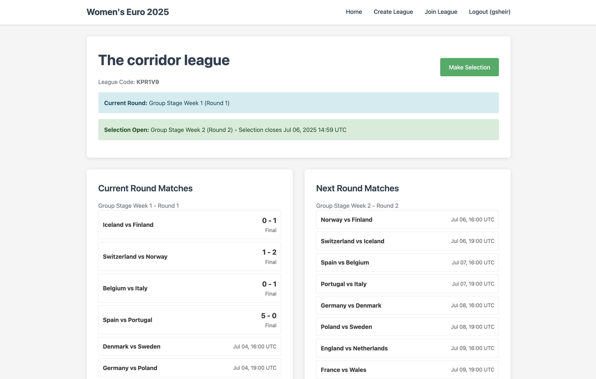
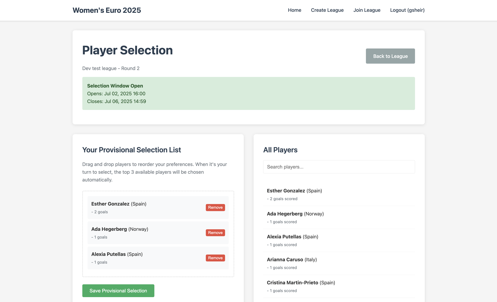

# gsheir.com

My personal website to host portfolios and random games.

## Deployment

### Railway

This application is deployed and hosted with Railway. Currently this is configured via the Railway dashboard, but I am hoping to move to IaC soon. 

The application is available on gsheir.com

### Local development

A Docker Compose configuration is provided for local development, which will spin up the services required (including the database). 

To set up:

Make sure you [have Docker installed](https://docs.docker.com/desktop/). Then

1. Copy environment variables to local `.env`
   ```bash
   cp .env.example .env
   ```

2. Run Docker Compose configuration
   ```bash
   docker compose up
   ```

3. Create superuser
   ```bash
   docker compose exec web python manage.py createsuperuser
   ```

   The web app will be available at `http://localhost:8080/`

## Women's Euro 2025 game

This project presents a fantasy draft game for the Women's Euro 2025, where participants can create and join leagues to compete against friends. 





### Sync with FBRef API

This application syncs with [FBR API](https://fbrapi.com/) for football data (although not all data is pulled from FBR API due to some bugs with the API). To sync, use

```bash
docker compose exec web python manage.py sync_fbr_data
```

### Process Round Results

Calculate points and update team selections:

```bash
docker compose exec web python manage.py process_round
```

### Admin Interface

Access the admin interface at `/admin/` to:
- Manage users, leagues, and teams
- Input match results manually

## License

This project is for personal use.
